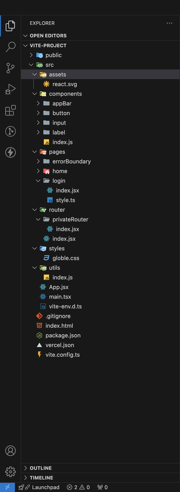
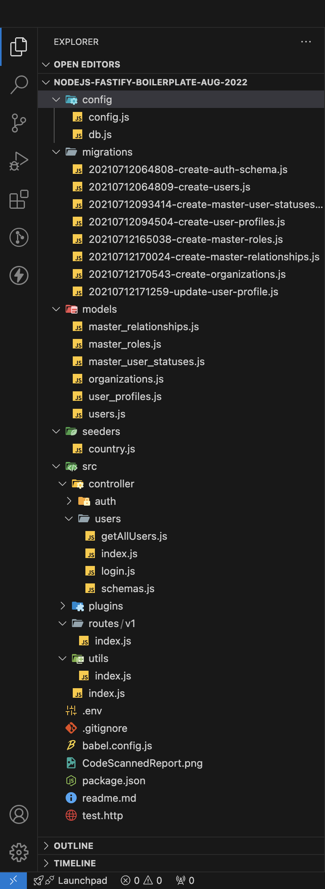
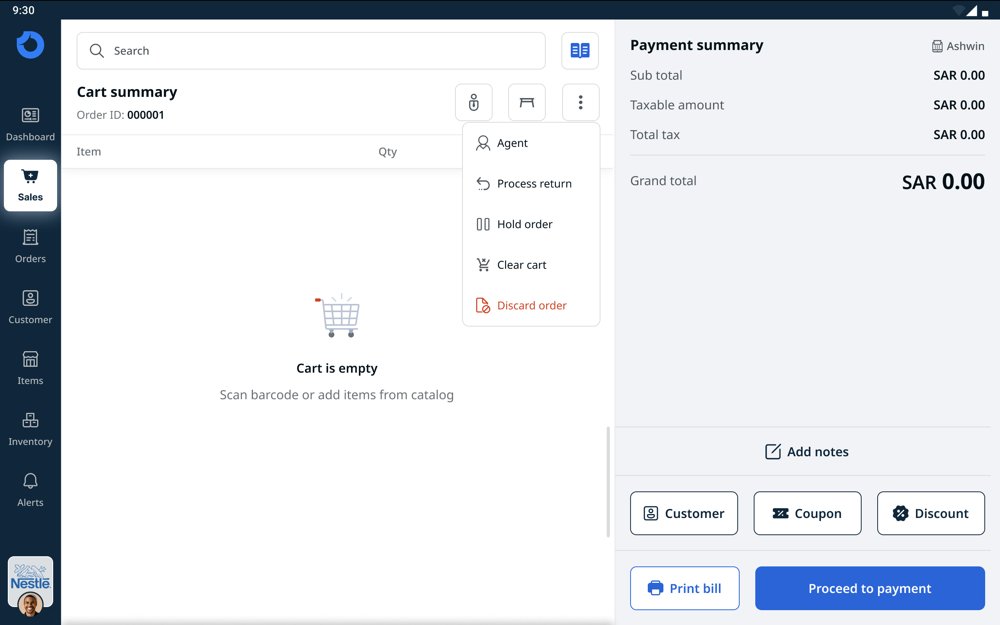
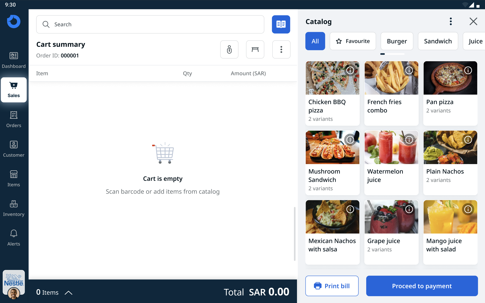
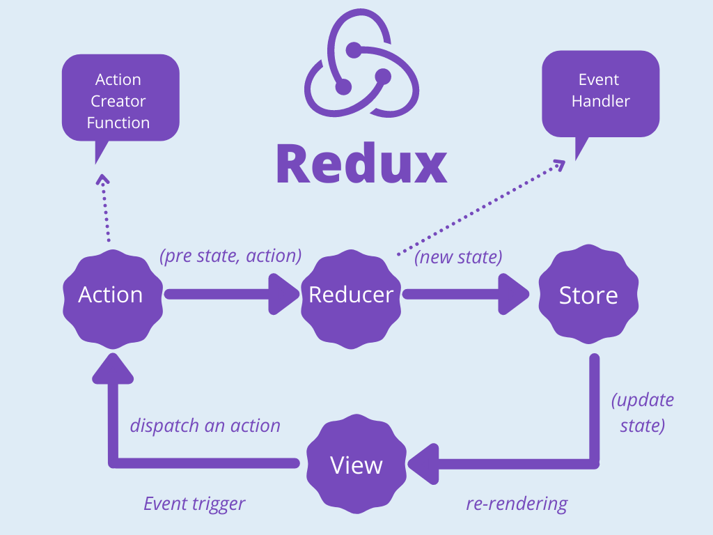
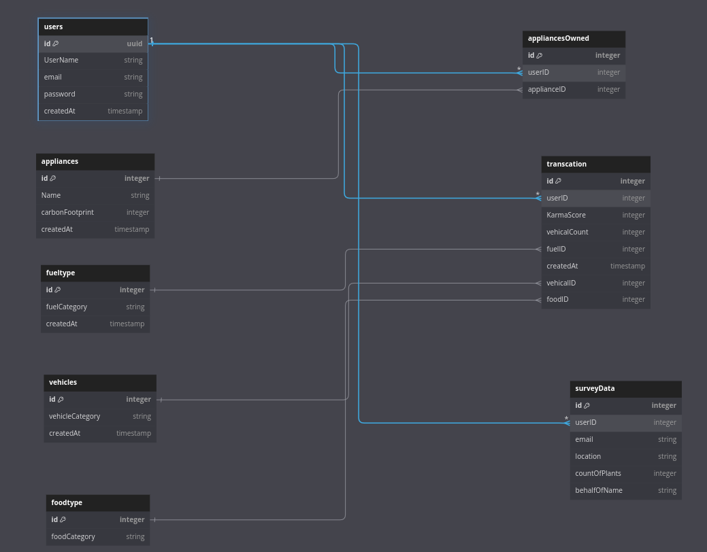

<div style="  padding: 20px; color:white; font-family: 'Roboto', sans-serif; font-size: 1.1em;">

<div style="display:flex; justify-content:center; ">

#  Fullstack - Crayon'd
</div>

## **Day 1 - 19/09/2024**:

- Focused on setting up an **industry-level folder structure** for both **frontend** and **backend** development. This is crucial for ensuring **scalability** and **organization** in larger projects.


<div style="display:flex; justify-content:center; gap:20px; margin-bottom:30px;
padding:10px;   box-shadow: rgba(50, 50, 93, 0.25) 0px 50px 100px -20px, rgba(0, 0, 0, 0.3) 0px 30px 60px -30px, rgba(10, 37, 64, 0.35) 0px -2px 6px 0px inset; ">
<div style="display:flex; flex-direction:column;  justify-content:center; align-items:center;">
  <h3>Front End boiler plate code </h3>
  
</div>

<div style="display:flex; flex-direction:column; justify-content:center; align-items:center;">
  <h3>Backend End boiler plate code </h3>
  
</div>
</div>

- Introduced to **Sequelize**, an **Object-Relational Mapping (ORM)** library that simplifies interactions with relational databases in **Node.js**. Sequelize helps manage database models, migrations, and queries in a structured manner.

  <span style="color: green;">**Sequelize**: An ORM for Node.js that provides a simple, clean syntax for database operations, making data manipulation easier and more efficient.</span>

  

## Getting Started with Sequelize
### <span style="color: orange;"> Step 1:</span> Install Sequelize and CLI

- First, install Sequelize and Sequelize CLI along with the necessary database dependencies in your backend directory (e.g., PostgreSQL,MySQL,...):

```bash
npm install sequelize sequelize-cli
npm install mysql2  # For MySQL
```

### <span style="color: orange;"> Step 2:</span> Initialize sequlize in backend directory

```bash
npx sequelize-cli init
```

- This command will generate the following directory structure:

```bash
├── config
│   └── config.json
├── models
│   └── index.js
├── migrations
└── seeders
```
### <span style="color: orange;"> Step 3:</span> generate a model and migration folder 

- Follow this step if you want to use class based syntax in model unless skip to  <span style="color: orange;"> **Step 4**</span>

- migration folder contains all the migration files which is use to create the schema of the database (structure)

- and the modal are represention od the table schema and used to intract with them

<span style="font-family: monospace; color:gray;"> 
this command takes some flags for attributes like fullName , lastName, email
</span>

```bash
npx sequelize-cli model:generate --name User --attributes firstName:string,        lastName:string,email:string
```
<span style="font-family: monospace; color:gray;"> 
this command will generate a sample user migration and model
</span>


### <span style="color: orange;"> Step 4:</span> follow step 4 instead of step 3 if you prefer object based syntax for models


- for object based syntax for models we need to custom create the models thus we need to first generate migration files alone by using

```bash
npx sequelize-cli migration:generate --name migration_name
```

<br/>

Emphasized how this structured approach not only improves **collaboration** but also enhances **debugging** efficiency.

Key takeaway: Understanding the **importance of separation of concerns** directly contributes to maintaining a **clean** and **scalable architecture**.

  <span style="color: skyblue;">This approach builds the foundation for long-term maintainability, which is critical in industry-level projects.</span>

<br>
<h3>For Undoing the Migartions: </h3>

```bash
npx sequelize-cli db:migrate:undo
```
This command will undo the recently upped migartion file

<h4>
For undoing all the migartions recenty changed:
</h4>

```bash
npx sequelize-cli db:migrate:undo:all
```
 

# Sequelize Seeders

### What are Seeders?

In Sequelize, **Seeders** are used to populate the database with initial data. This is particularly useful when you need to set up default values or create sample data for testing purposes.

Seeders allow you to define and insert specific data sets into your database in a systematic and organized manner.

### Creating Seeders

You can create a new seeder file using the Sequelize CLI with the following command:

```bash
npx sequelize-cli seed:generate --name <seeder_name>
```
### Running Seeders
```bash
npx sequelize-cli db:seed:all
```
This command will run all the seeders
### Undoing Seeders
```bash
npx sequelize-cli db:seed:undo:all
```
This command will undo all the seeders

## Sequelize MetaData
The primary function of the SequelizeMeta table is to record which migration or seeder files have been executed. It helps maintain the integrity of database operations across different environments (development, testing, production) by tracking

Migrations: Tracks applied schema changes to the database (e.g., creating or altering tables).
Seeders: Tracks the initial or test data that has been inserted into the database.
Without the SequelizeMeta table, Sequelize would not know which migrations or seeders have already been applied, potentially causing duplicate schema changes or data entries.

## **Day 2 - 20/09/2024**:

- **Git** and **GitHub** were introduced for **version control** and **collaboration** in software development. We learned how to:
  - Initialize repositories
    ```bash
    git init
    ```
  - Create branches
    ```bash
    git branch <branch_name>
    ```
  - Switch between branches
    ```bash
    git checkout <branch_name>
    ```
-  Make pull requests
    (Pull requests are created on GitHub, typically through the GitHub interface after pushing branches.)
- Resolve merge conflicts
    (Merge conflicts are resolved during the merge process, typically by editing conflicting files and then committing the changes.)

  <span style="color: green;">**Git**: A version control system that tracks changes in code, enabling multiple developers to collaborate without overwriting each other's work.</span>

  <span style="color: green;">**GitHub**: A web-based platform for hosting Git repositories, facilitating collaboration and code sharing among development teams.</span>

- Continued working with **Sequelize**, exploring real-world applications to simplify database interactions. Hands-on practice was invaluable in understanding how Sequelize works in practical scenarios.

- Branching strategies were also covered, helping manage feature development in parallel without code conflicts.

- **Merge conflict resolution** was practiced, which is a critical skill in team-based development.

### Common Git Commands used 

- **Clone a repository**
```bash
  git clone <repository_url>

  git status

  git add <file_name>      # Add a specific file

  git add .                # Add all changes

  git commit -m "Commit message describing the changes" #Commit changes

  git fetch origin # Pull the repository 

  git push origin <branch_name> # Push changes to a remote repository

  git fetch origin #Fetch changes from a remote repository

  git pull origin <branch_name> #Pull changes from a remote repository

  git merge <branch_name> #Merge branches
```

## **Day 3 - 21/09/2024**:

- A full-stack **eCommerce project** was assigned, which involved building both the frontend and backend using **Sequelize** for database management.

  
  


</div>

  - **Folder structures** and **Git** were essential tools used throughout the project.
  - The project covered everything from designing the **database models** to developing the **user interface**.

- This exercise encouraged teamwork and integration of different technologies, fostering better problem-solving skills.


- It gave us valuable experience in designing the architecture of a full application, from database models to the user interface.

- Overall, it was a great exercise in problem-solving and collaboration, preparing us for more complex, real-world scenarios.


  <span style="color: skyblue;">This project served as a bridge between theoretical knowledge and practical application, simulating real-world challenges faced in industry-level projects.</span>

<br>

## **Day 4 - 23/09/2024**:

- The **Crayon team** reviewed our weekend project and provided detailed feedback. Areas of improvement included:
  - **Optimizing database queries**
  - **Refining UI components**
  - **Managing folder structure**

- This personalized feedback was incredibly helpful, allowing me to clearly see my strengths and the areas where I could improve.

- Assigned smaller, focused tasks to refine these areas. This feedback-driven approach helped boost confidence in **problem-solving** and **debugging** real-world applications.

  <span style="color: skyblue;">Breaking down complex problems into manageable tasks is a key industry practice, ensuring that each component is thoroughly refined and optimized.</span>

<br>

## **Day 5 - 24/09/2024**:

- Advanced topics like **asynchronous programming** and **global state management** with **Redux** were introduced.

  <span style="color: green;">**Redux**: A state management tool for JavaScript apps, providing a centralized place to manage application state and make data flow more predictable.</span>

  

  **Redux** helps manage complex data flows and user interactions across components.

- **React Hooks** and the **Context API** were also explored, allowing efficient data management without **prop drilling**.

  <span style="green;">**React Hooks**: Functions that let you "hook into" React state and lifecycle features from functional components.</span>

- Gained a better understanding of **scalable database architecture**.

  <span style="color: skyblue;">Learning how to manage both state and data efficiently is vital when working on dynamic, data-driven applications in a real-world setting.</span>

<br>

## **Day 6 - 25/09/2024**:

- Explored advanced Git techniques, including team collaboration and branch strategies.

- Hands-on practice with **Sequelize** and **Redux** further solidified our understanding of these concepts.

- Designed a **database structure** using the no-code platform **Db Diagram**. This helped visualize and plan out the architecture for scalable databases.

  <span style="color: skyblue;">Refining these skills is crucial for maintaining organized, efficient systems as the complexity of the project grows.</span>

    


<br>

## **Day 7 - 26/09/2024**:

- The seventh day focused on industry-level **code management** using the **Git flow** approach, a methodology for managing code across multiple teams and environments.

  <span style="color: green;">**Git Flow**: A workflow design for Git that helps manage feature development and release cycles in production environments.</span>

- Assigned to work on the **Karma Calculator** feature for an existing application, **Produkt**, as full-stack developers responsible for:
  - Backend logic and database management
  - Integrating the frontend with the backend

- This task gave us insights into managing **production-level code** and working in multi-developer environments.

  <span style="color: skyblue;">By applying Git Flow principles, we gained valuable experience in maintaining a robust, well-structured codebase, essential for any industry-level project.</span>

- **UI Link**: [Adobe UI](https://xd.adobe.com/view/c3a27cec-9eaf-451f-b34a-606778ed2516-96f1/screen/55cd3995-8d22-423f-8672-c70a3b23bcec/)

</div>

